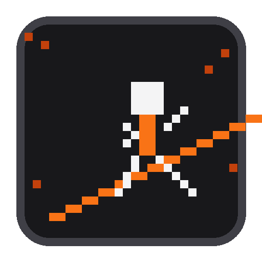

# 🏃 跑蓝 RunCoach Agent

> **像展示作品一样展示你的跑步生涯**

基于 Strava 数据同步的 AI 跑步分析 Web 应用，集成 AI 训练解读、周期化课表、路线聚类与数据可视化。

像素风 UI · CRT 扫描线 · 橙色数据强调 · 复古终端美学

---

## 🌐 在线体验

**生产环境**: https://runcoach-agent-tau.vercel.app/



---

## ✨ 功能特性

### 已上线

| 模块 | 功能 | 状态 |
|------|------|------|
| **Strava 同步** | OAuth 授权 + 活动拉取 + 数据清洗 | ✅ |
| **AI 对话** | Kimi k2.5 实时训练建议 | ✅ |
| **训练计划** | 周期化课表（基础→建设→巅峰→taper） | ✅ |
| **数据可视化** | 像素风仪表盘（趋势图/配速区间/统计卡片） | ✅ |
| **AI 训练分析** | 活动结构解析 + 训练类型分类 + 质量评分 1-10 | ✅ |
| **路线地图** | Leaflet 聚类地图 + 热力效果 | ✅ |
| **训练提醒** | Vercel Cron 每日 7 点提醒 | ✅ |
| **移动端** | 响应式布局 + PWA 基础 | ✅ |
| **持久化** | Upstash Redis 跨会话存储 | ✅ |

### 像素风设计

- `font-pixel` 像素字体
- CRT 扫描线叠加
- 故障文字动画
- zinc monochrome 基底 + orange 数据强调色

---

## 🚀 快速开始

### 环境变量

复制 `.env.local.example` 为 `.env.local`：

```bash
cd web
cp .env.local.example .env.local
```

填入以下变量：

| 变量 | 说明 | 必填 |
|------|------|------|
| `KIMI_API_KEY` | Kimi API Key | ✅ |
| `UPSTASH_REDIS_REST_URL` | Upstash Redis REST URL | ✅ 生产 |
| `UPSTASH_REDIS_REST_TOKEN` | Upstash Redis REST Token | ✅ 生产 |
| `STRAVA_CLIENT_ID` | Strava OAuth Client ID | ✅ Strava 同步 |
| `STRAVA_CLIENT_SECRET` | Strava OAuth Client Secret | ✅ Strava 同步 |
| `NEXT_PUBLIC_STRAVA_CLIENT_ID` | Strava Client ID（前端用） | ✅ Strava 同步 |

### 本地开发

```bash
cd web
npm install
npm run dev -p 3675
# 打开 http://localhost:3675
```

### Vercel 部署

1. 在 [Vercel Dashboard](https://vercel.com) 导入 GitHub 仓库
2. **Root Directory** 设置为 `web/`
3. 添加上述环境变量
4. 自动部署完成

---

## 📁 项目结构

```
runcoach-agent/
├── web/                         # Next.js 14 App Router
│   ├── app/                     # 页面路由
│   │   ├── page.tsx             # 主界面（像素风聊天 + 仪表盘）
│   │   ├── layout.tsx           # 根布局（PWA + Leaflet）
│   │   └── api/                 # API 路由
│   │       ├── chat/route.ts    # Agent 对话（Kimi LLM）
│   │       ├── runs/route.ts    # 跑步记录 CRUD
│   │       ├── profile/route.ts # 用户资料
│   │       ├── strava/route.ts  # Strava OAuth + 同步
│   │       ├── plan/route.ts    # 训练计划生成
│   │       ├── analysis/route.ts# AI 训练分析
│   │       ├── routes/cluster/  # 路线聚类
│   │       ├── reminder/route.ts# 今日训练提醒
│   │       └── cron/training-reminder/  # Vercel Cron
│   ├── components/              # React 组件
│   │   ├── Chat.tsx             # 聊天界面
│   │   ├── Dashboard.tsx        # 数据仪表盘
│   │   ├── RouteMap.tsx         # 路线聚类地图
│   │   ├── TrainingPlan.tsx     # 训练计划展示
│   │   ├── CRTOverlay.tsx       # CRT 扫描线效果
│   │   └── ...
│   ├── lib/                     # 服务端逻辑
│   │   ├── core/                # Agent 核心
│   │   │   ├── agent.ts         # Web 版 Agent Loop
│   │   │   └── llm.ts           # Kimi LLM 封装（稳定性重试）
│   │   ├── storage/upstash.ts   # Upstash Redis 封装
│   │   ├── strava/              # Strava 同步
│   │   ├── training/            # 训练计划引擎
│   │   ├── analysis/            # AI 训练分析
│   │   │   ├── structure.ts     # 配速突变点检测
│   │   │   └── classify.ts      # 动态 E/M/T/I/R 区间
│   │   ├── map/                 # 路线聚类
│   │   └── ...
│   ├── public/                  # 静态资源
│   │   ├── icon-192.png         # PWA Icon
│   │   ├── icon-512.png
│   │   ├── apple-touch-icon.png
│   │   └── manifest.json        # PWA Manifest
│   └── package.json
│
├── src/                         # CLI 核心（本地开发）
│   ├── core/                    # Agent Loop + LLM
│   ├── tools/                   # 工具层
│   ├── memory/                  # 记忆系统
│   ├── rag/                     # RAG 知识库
│   ├── workflow/                # Workflow 编排
│   ├── multi-agent/             # Multi-Agent 协作
│   ├── mcp/                     # MCP 协议
│   └── eval/                    # 评测系统
│
├── docs/                        # 知识库
└── README.md
```

---

## 🧠 核心架构

### Agent Loop

```
用户输入
  ↓
创建上下文 (Memory + RAG + Strava 数据)
  ↓
LLM 判断意图 → 选择工具
  ↓
调用工具 → 观察结果 → 继续推理
  ↓
返回最终回答 + 保存记录
```

### AI 训练分析引擎

```
Strava Splits
  ↓
配速突变点检测（1.5σ 阈值）
  ↓
结构划分：warmup / main / cooldown
  ↓
动态配速区间（最近 10 次百分位）
  ↓
训练类型分类：E/M/T/I/R
  ↓
质量评分 1-10 + AI 训练解读
```

### 路线聚类

```
Strava Polyline
  ↓
解码起点/终点
  ↓
Haversine 距离 < 500m
  ↓
聚类命名：路线 A、路线 B...
  ↓
Leaflet 热力圆圈（大小=次数，颜色=距离）
```

---

## 🛠 技术栈

| 层级 | 技术 |
|------|------|
| **Runtime** | Node.js 20+ + TypeScript (ESM) |
| **Web** | Next.js 14 (App Router) + React + Tailwind CSS |
| **UI 风格** | 像素风 + CRT 扫描线 + zinc monochrome + orange accent |
| **LLM** | Kimi k2.5 (temperature 0.6) + SDK 自动重试 + 备用模型链 |
| **Memory** | Upstash Redis (生产) / JSON 文件 (本地) |
| **RAG** | TF-IDF 内存向量检索 |
| **数据同步** | Strava OAuth v3 API |
| **地图** | Leaflet + CartoDB Dark Matter |
| **图表** | Recharts |
| **部署** | Vercel Serverless + Vercel Cron |
| **PWA** | Web App Manifest + Service Worker |

---

## 📊 数据流

```
Strava API → normalize → Upstash Redis → Agent Context → Kimi LLM → Structured Response
                ↓                                              ↓
           数据清洗                                      训练计划/分析/建议
                ↓                                              ↓
           配速/心率/距离                                像素风 Dashboard
```

---

## 🎯 使用示例

### 同步 Strava 数据

1. 点击「连接 Strava」按钮
2. OAuth 授权
3. 自动拉取最近 30 条活动

### 查看训练分析

```
用户: 分析我上周的间歇训练
Agent: 检测到 6 组 800m 间歇，配速 4:05/km，组间恢复 2:30。
      质量评分: 8/10。建议：下次缩短恢复至 2:00，提升刺激强度。
```

### 生成训练计划

```
用户: 帮我制定一个全马 330 的计划
Agent: 生成 16 周周期化课表...
      基础期 4 周 → 建设期 6 周 → 巅峰期 4 周 → taper 2 周
```

### 路线聚类

```
用户: 我常跑的路线有哪些？
Agent: 发现 3 条主要路线：
      - 路线 A（滨江绿道）：跑过 12 次，总距离 156km
      - 路线 B（公园环线）：跑过 8 次，总距离 64km
      - 路线 C（操场间歇）：跑过 5 次，总距离 20km
```

---

## ⚠️ 已知问题

| 问题 | 状态 | 说明 |
|------|------|------|
| Kimi API 429 | 🟡 缓解 | SDK 自动重试 3 次 + 备用模型链，通常 30-60s 恢复 |
| Strava Token 过期 | 🔴 待修复 | 6 小时过期，刷新逻辑待实现 |
| 路线聚类空数据 | 🟡 正常 | 需 Strava 活动有 summary_polyline 才显示 |

---

## 🔮 后续扩展

- [ ] Strava Token 自动刷新
- [ ] 向量数据库（Pinecone/Chroma）替换 TF-IDF
- [ ] 更多 MCP Server（Garmin、Notion、Apple Health）
- [ ] Eval 增强（embedding-based 语义相似度）
- [ ] 用户认证（NextAuth + 多用户隔离）
- [ ] 社交功能（跑团、排行榜）

---

## 📜 License

MIT

---

> **Agent = LLM + 工具 + 状态 + 决策循环 + 约束 + 评估**
>
> 《学习 Agent，10 天从入门到精通》完整实战项目。
